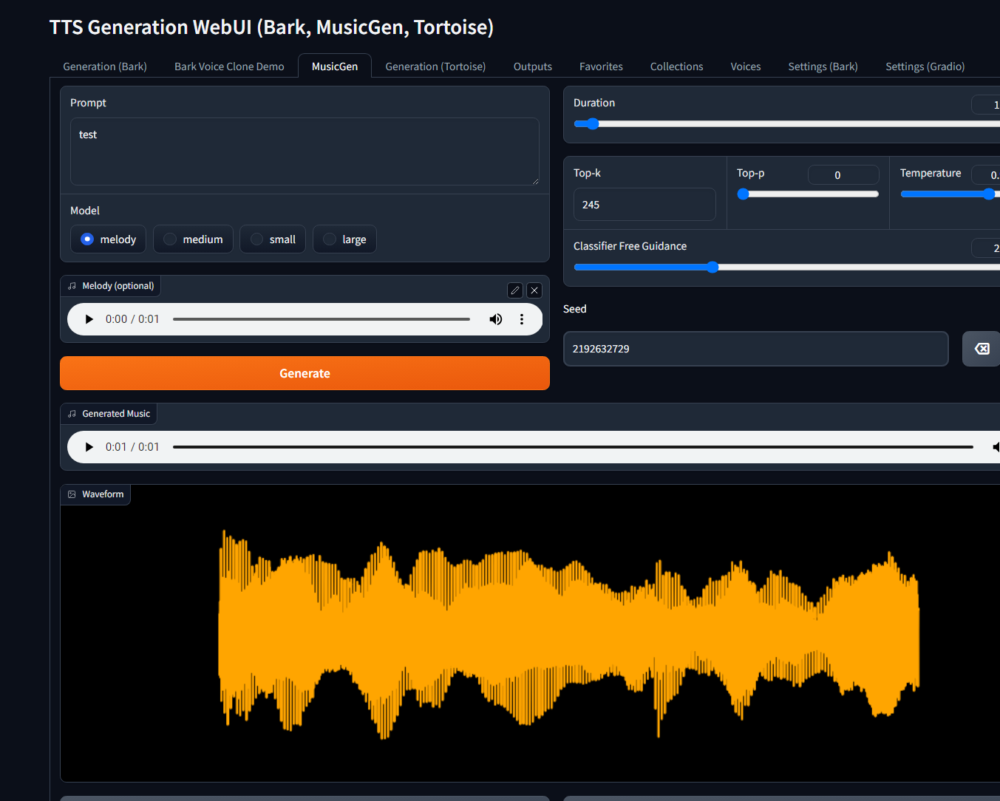

# TTS Generation WebUI (Bark v2, MusicGen, Tortoise, Vocos)

## Videos
### **The AI Artist - Stable diffusion for MUSIC ?! tts-generation-webui**

### **The AI Artist - how to use BARK AI voice cloning locally**

## Screenshots

This code provides a Gradio interface for generating audio from text input using the Bark TTS and Tortoise TTS models. The interface takes a text prompt as input and generates audio as output.

.png)
.png)

[audio__bark__continued_generation__2023-05-04_16-07-49_long.webm](https://user-images.githubusercontent.com/6757283/236218842-b9dc253e-05de-49e5-ada9-e714e1e2cbd4.webm)

[audio__bark__continued_generation__2023-05-04_16-09-21_long.webm](https://user-images.githubusercontent.com/6757283/236219228-518d2b70-51a3-4175-af44-b24c01d14932.webm)

[audio__bark__continued_generation__2023-05-04_16-10-55_long.webm](https://user-images.githubusercontent.com/6757283/236219243-dad96404-0879-4274-828e-7f3afc6bac65.webm)

## Dependencies

This code requires the following dependencies:

- `bark` in models/bark directory from https://github.com/suno-ai/bark
- `scipy`
- `gradio`

## Open Source Libraries

This project utilizes the following open source libraries:

- **suno-ai/bark** - [MIT License](https://github.com/suno-ai/bark/blob/main/LICENSE)
  - Description: A powerful library for XYZ.
  - Repository: [suno/bark](https://github.com/suno-ai/bark)

- **tortoise-tts** - [Apache-2.0 License](https://github.com/neonbjb/tortoise-tts/blob/master/LICENSE)
  - Description: A flexible text-to-speech synthesis library for various platforms.
  - Repository: [neonbjb/tortoise-tts](https://github.com/neonbjb/tortoise-tts)

- **ffmpeg** - [LGPL License](https://github.com/FFmpeg/FFmpeg/blob/master/LICENSE.md)
  - Description: A complete and cross-platform solution for video and audio processing.
  - Repository: [FFmpeg](https://github.com/FFmpeg/FFmpeg)
  - Use: Encoding Vorbis Ogg files

- **ffmpeg-python** - [Apache 2.0 License](https://github.com/kkroening/ffmpeg-python/blob/master/LICENSE)
  - Description: Python bindings for FFmpeg library for handling multimedia files.
  - Repository: [kkroening/ffmpeg-python](https://github.com/kkroening/ffmpeg-python)

- **audiocraft** - [MIT License](https://github.com/facebookresearch/audiocraft/blob/main/LICENSE)
  - Description: A library for audio generation and MusicGen.
  - Repository: [facebookresearch/audiocraft](https://github.com/facebookresearch/audiocraft)

- **vocos** - [MIT License](https://github.com/charactr-platform/vocos/blob/master/LICENSE)
  - Description: An improved decoder for encodec samples
  - Repository: [charactr-platform/vocos](https://github.com/charactr-platform/vocos)
